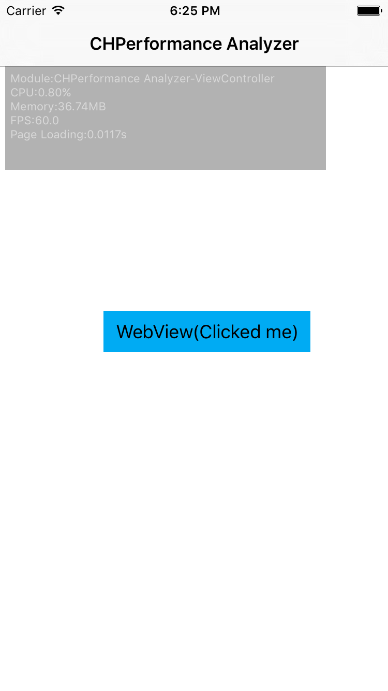
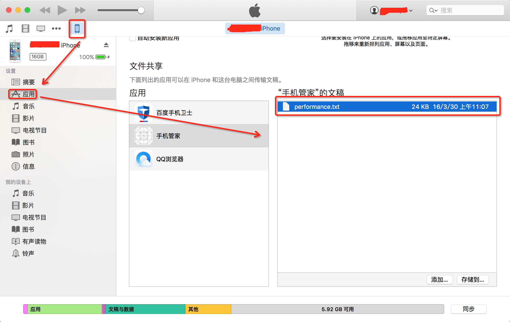

# PerformanceAnalyzer 开源啦!!!
iOS平台下可对APP的CPU、FPS、Memory、LoadingTime进行内部统计的一款工具，并提供统计数据的输出。新增奖励在FMDatabase framework上的SQL执行耗时监控和UI刷新监控。
# 前言
有项目需求，所以做了这款性能分析工具。正如简介所说，它可以统计iOS APP的CPU、FPS、Memory、LoadingTime。由于我在工具内部设定的是默认0.5秒统计一次所有数据（FPS除外，它一秒统计一次）故而内存开销可能比较大，所以如果你特别在意内存，建议只统计内存，把其它统计项关掉，至于怎么关掉，可以看看后文的详解。
# 特性
- **统计CPU、FPS、Memory、LoadingTime**，并且他们都可以按需统计。
- 自定义页面加载时间的结束检查点。
- 跳过一些你不想统计的模块。
- 摇晃手机可以开启或者关闭analyzer。
- 将统计数据生成文件并存储在沙盒中。
- **SQL 执行耗时监控**，设置超时阀值，当SQL执行超时后，你将会收到通知。
- **UI 刷新监控**，如果view不在主线程刷新，你将会收到通知。
- 获取analyzer统计的最原始的统计数据。

# 如何使用
- 将'PerformanceAnalyzer/CHPerformanceAnalyzer/CHPerformanceAnalyzer/PerformanceAnalyzer1.0.1/'拷贝至你的工程即可。
- 启动你的APP吧，我们为效率而生！
- 就只需要这样，不需要额外的代码。

# Demo截图



你可以移动它到你想要的位置。


# 扩展使用
## 自定义数据统计项
你可以在全局的任何地方定义`CHPerformanceAnalyzerShowType CHPerformanceAnalyzerShowTypeSetting;`来控制统计项，它的值请看[CHGlobalDefines.h](./CHPerformanceAnalyzer/CHPerformanceAnalyzer/PerformanceAnalyzer1.0.1/CHGlobalDefines.h)中的定义。

## 自定义的AppDelegate
一般来说，你的app delegate（遵从UIApplicationDelegate协议的类）是AppDelegate，如果不是怎么办呢，你只需要在全局的任何地方定义`NSString *CHPerformanceAnalyzerApplicationDelegateClassName = @"YourAppDelegate";`即可。

> 在我上传的`PerformanceAnalyzer`文件夹下有`CHPerformancerExterns.m`，你可以在这里面完成上面的操作，默认地，这里面已经有一些内容了，你可以做适当修改。

## 如何获得统计数据
- 当你用两根手指连续点击统计界面2次就会将当前的统计数据保存到沙盒。
- CHPerformanceAnalyzer有一个delegate，它遵从CHPerformanceAnalyzerDelegate协议，这个协议有个可选方法`- (void)performanceAnalysis:completeWithFilePath:`，每当你触发了保存操作后，它就会被调用。它会告诉你数据保存的位置。
- analyzer把统计数据保存在了沙盒的共享目录下，你可以给工程的info.plist添加'Application supports iTunes file sharing'字段，并设置为`YES`，你就可以把手机连上iTunes，在`应用`界面，向下滑到'文件共享'栏，选择你的APP，就会看到下图：

`performance.txt`就是统计数据了。
- 统计数据的格式是Excel的csv格式，它是可以直接导入Excel的，具体教程请看[这里](http://jingyan.baidu.com/article/e6c8503c2d44e3e54f1a18c7.html)。analyzer的默认的数据分隔符是英文逗号，请记得选择。转换的时候，可能有编码问题，如果出现这个问题，建议先把原始数据转换成中文编码再导入。

## 自定义设置加载时间的END FLAG
如果有的view controller比较特殊，需要延迟一会儿才能加载完整个界面，而此时`- (void)viewDidAppear:`已经被调用过。此时，需要自己去定制一个方法去表示END FLAG并替换analyzer的END FLAG。你可以查看我在PerformanceAnalyzer里面的[CHPerformancerExterns.m](./CHPerformanceAnalyzer/CHPerformanceAnalyzer/PerformanceAnalyzer1.0.1/DataRepresentation/CHPerformancerExterns.m)文件。为了方便解释，这里贴出代码：

```Objective-C
    @interface WebViewController (PageLoading)

    @end

    @implementation WebViewController (PageLoading)

    - (void)loadView_aop2
    {
        CHPerformanceAnalyzer *analyzer = [CHPerformanceAnalyzer sharedPerformanceAnalyzer];
        // 反观察者模式，让analyzer成为这个'self'的观察者，去关注属性路径'navigationItem.title'
        [analyzer addObservered:self forKeyPath:@"navigationItem.title"];
        // 这句只能在上面的后面，颠倒位置将不会正确统计信息
        [self loadView_aop2];
    }

    - (void)viewDidDisappear_aop:(BOOL)animated
    {
        [self viewDidDisappear_aop:animated];
        CHPerformanceAnalyzer *analyzer = [CHPerformanceAnalyzer sharedPerformanceAnalyzer];
        // 这句要与'[analyzer addObservered:self forKeyPath:@"navigationItem.title"];'成对出现，否则将会抛出异常，因为底层的实现就是观察者模式。
        [analyzer removeObservered:self forKeyPath:@"navigationItem.title"];
    }
    
    @end

    void(^CHPerformanceAnalyzerAOPInitializer)() = ^{
        CHPerformanceAnalyzer *analyzer = [CHPerformanceAnalyzer sharedPerformanceAnalyzer];
    [analyzer registerLoadingRuleWithClass:[WebViewController class]
                          originalSelector:@selector(loadView)
                                    newSEL:@selector(loadView_aop2)];
    [analyzer registerLoadingRuleWithClass:[WebViewController class]
                          originalSelector:@selector(viewDidDisappear:)
                                    newSEL:@selector(viewDidDisappear_aop:)];
    };
```
我们加载一个网页的时候，当调用了协议方法`- (void)webViewDidFinishLoad:`后，就代表网页加载完毕了，我在这个方法中更改了navigation的标题。
`[analyzer addObservered:self forKeyPath:@"navigationItem.title"]`的作用就是让analyzer作为Controller的观察者，观察Controller的`navigationItem.title`属性路径，当发生了新值变化后，analyzer就会收到对应通知，此时analyzer就会更新页面的加载时间。你也可以关注其它属性路径，我这儿只是抛砖引玉。

其中`[self loadView_aop2]`和在`CHPerformanceAnalyzerAOPInitializer`block中的
```
[analyzer registerLoadingRuleWithClass:[WebViewController class]
                      originalSelector:@selector(loadView)
                                newSEL:@selector(loadView_aop2)];
```
这两句的代码以及顺序不能颠倒，这两句采用了AOP技术，更新内部实现。

注意：不能使用`loadView_aop`作为你的自定义函数名字，analyzer内部采用了这个名字，如果不幸，你这样使用，将会进入无限递归直至爆栈。

## 提供统计数据接口
现在，你可以通过属性`modulesOfStatistic`获得分析器经历的所有模块的名称，然后根据这些模块调用`- (id)statisticsWithType:ofKey:`获得统计数据，返回值一般是一个NSArray对象，为了方便今后增加新的统计数据模型，故这里写成id类型。

## 关闭统计
摇晃手机就可以关闭anayzer，再次摇晃就会开启。

# 注意
- Module的名字来自`viewController`的`title`属性，如果没有就会取`navigationItem`的`title`属性。如果还没有，就会尝试调用delegate的`- (NSString *)performanceAnalyzer: titleMethodWithViewController:`方法。
- 每个View Controller的加载时间是从调用`- (void)loadView`前开始，直到调用完`- (void)viewDidAppear:`

# Enviroment
- Xcode 7.3
- iOS 7.0+
- [PureLayout](https://github.com/PureLayout/PureLayout)
- ExtObj
