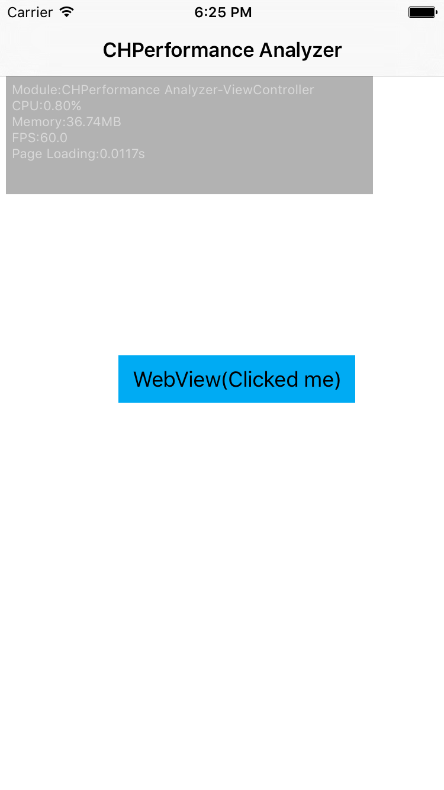
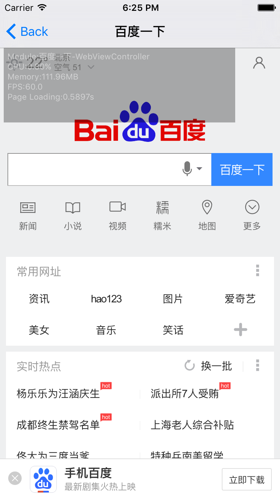
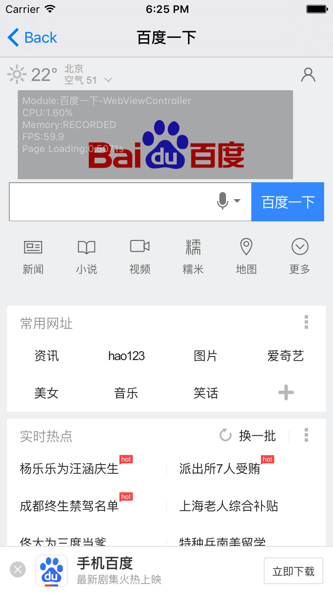
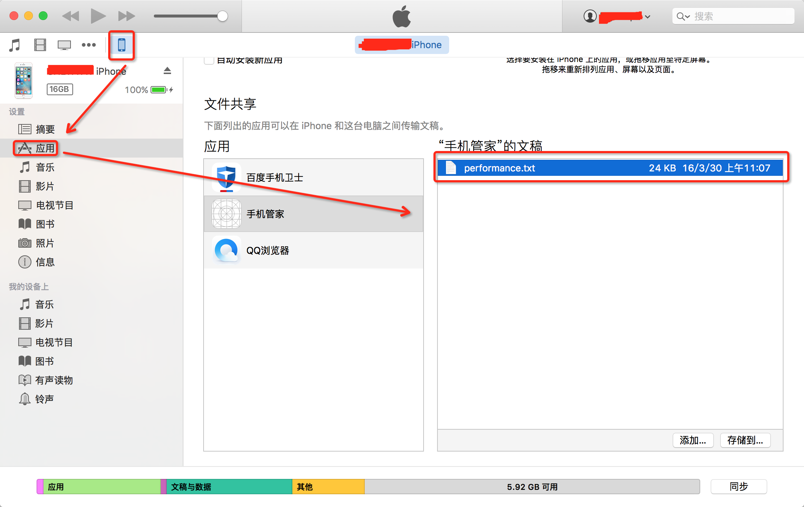

> - 中文介绍请看[这里](./README.CN.md)
> - 支持静态库方式启动analyzer：[Support static library](./PerformanceAnalyzer/)

# PerformanceAnalyzer
Under the iOS platform, the analyzer is a tool which statistics CPU, FPS, Memory, Loading-Time and provides the output of statistical data. And contain SQL execution time monitor base on FMDatabase and UI refresh in main thread monitor

# Preface
Because of the needs of project, I write the code for performance analyzer. As above, the analyzer can statistic some app-data, such as CPU, FPS, Memory, Loading-Time. And the memory overhead may be large because analyzer statistics every 0.5s defaultly(except FPS, it does it every 1s). So If you really care about memory overhead, you can switch off other statistical items and only open the Memory statistical item. As for how to turn off, you can see the detailed in below chapters.

# Features
- **Statistic CPU, FPS, Memory, PageLoading-time**. And them can be controled to show.
- Custom set the end flag of Loading-time.
- Skip modules which you don't want.
- Freedom to turn on or turn off by shake the iPhone device.
- Generate output file in sandbox.
- **SQL execution time monitor***. Set the threshold of the time. If timeout, you will receive notification.
- **UI refresh monitor**. If a view does not refresh in main thread, you will receive notification.
- Get statistical data.

# How To Use
- Copy directory `PerformanceAnalyzer/CHPerformanceAnalyzer/CHPerformanceAnalyzer/PerformanceAnalyzer1.0.1/` to your project.
- Run your APP!!! Don't need to do anythig except that.

# Demo - Screenshot



**You can move it to anywhere.**


# Extended Use
## Custom data statistics
You can define `CHPerformanceAnalyzerShowType CHPerformanceAnalyzerShowTypeSetting;` anywhere in the global to control statistical items. The value of `CHPerformanceAnalyzerShowType` just see [CHGlobalDefines.h](./CHPerformanceAnalyzer/CHPerformanceAnalyzer/PerformanceAnalyzer1.0.1/CHGlobalDefines.h)
 
## Custom AppDelegate
Generally, your app delegate which is a class follows UIApplicationDelegate protocol is `AppDelegate`. But if not, you need define `NSString *CHPerformanceAnalyzerApplicationDelegateClassName = @"YourAppDelegate";` anywhere in the global.
> You can complete above things in source code [CHPerformancerExterns.m](./CHPerformanceAnalyzer/CHPerformanceAnalyzer/PerformanceAnalyzer1.0.1/DataRepresentation/CHPerformancerExterns.m). Defaultly, there has some content and you may need to modify it.

## How To Get Statistical Data
- Analyzer will save current statistical data to sandbox when you tap statistical window twice by two fingers.
- CHPerformanceAnalyzer has a delegate which follows CHPerformanceAnalyzerDelegate protocol which contains an optional method `- (void)performanceAnalyzer:completeWithFilePath:`. Delegate will tell you fullpath of data save when you trigger save operation.
- Analyzer save the data at shared directory of sandbox. You can add field `Application supports iTunes file sharing` into 'info.plist' and set it to `YES`. And then connect the iPhone to iTunes. And select `Application` item at iTunes and slide down to 'File Sharing' bar at right side. Finally, select your app, and later you can see content like below picture.

**File `performance.txt` saved the data**
- The format of statistical data is CSV-fromat of Excel. It can be import into Excel. You can find the import-tutorial at [here](http://jingyan.baidu.com/article/e6c8503c2d44e3e54f1a18c7.html)(uhm..Chinese needed). Remember the separator is comma(',') defaultly. And If occur problem when transforming, I suggest that thansform the original data to CN-encoding such as 'GB2312' before import.

## Custom Set the End Flag of Loading-Time
Sometimes view controller is special, that is, finishing loading the whole view is needed much time and meanwhile method `- (void)viewDidAppear:` has been called. So, we need make a method to represent 'END FLAG' and replace analyzer's 'END FLAG'. Detailed code is in [CHPerformancerExterns.m](./CHPerformanceAnalyzer/CHPerformanceAnalyzer/PerformanceAnalyzer1.0.1/DataRepresentation/CHPerformancerExterns.m).
```Objective-C
    @interface WebViewController (PageLoading)

    @end

    @implementation WebViewController (PageLoading)

    - (void)loadView_aop2
    {
        CHPerformanceAnalyzer *analyzer = [CHPerformanceAnalyzer sharedPerformanceAnalyzer];
        // Observered Model. Make analyzer become observer of the self to concern the property path'navigationItem.title'.
        [analyzer addObservered:self forKeyPath:@"navigationItem.title"];
        // Fixed position.
        [self loadView_aop2];
    }

    - (void)viewDidDisappear_aop:(BOOL)animated
    {
        [self viewDidDisappear_aop:animated];
        CHPerformanceAnalyzer *analyzer = [CHPerformanceAnalyzer sharedPerformanceAnalyzer];
        // '[analyzer addObservered:self forKeyPath:@"navigationItem.title"];' must be called, otherwise there will throw exception.
        [analyzer removeObservered:self forKeyPath:@"navigationItem.title"];
    }
    
    @end

    void(^CHPerformanceAnalyzerAOPInitializer)() = ^{
        CHPerformanceAnalyzer *analyzer = [CHPerformanceAnalyzer sharedPerformanceAnalyzer];
    [analyzer registerLoadingRuleWithClass:[WebViewController class]
                          originalSelector:@selector(loadView)
                                    newSEL:@selector(loadView_aop2)];
    [analyzer registerLoadingRuleWithClass:[WebViewController class]
                          originalSelector:@selector(viewDidDisappear:)
                                    newSEL:@selector(viewDidDisappear_aop:)];
    };
```

Finishing a webpage when method `- (void)webViewDidFinishLoad:` has been called. I change the title of navigation. Function `[analyzer addObservered:self forKeyPath:@"navigationItem.title"]` make anlayzer become observer of controller to concern the property path `navigationItem.title`. When its value has been changed, analyzer will receive notification and update the loading-time. You can also concern other property path. I just throw out a minnow to catch a whale.

In `[self loadView_aop2]` and `CHPerformanceAnalyzerAOPInitializer`

```
[analyzer registerLoadingRuleWithClass:[WebViewController class]
                      originalSelector:@selector(loadView)
                                newSEL:@selector(loadView_aop2)];
```

Their order cannot be reversed.

Note: can't use `loadView_aop` as your name of custom method. Analyzer uses the name in the internal. If you do, program will go into infinite recursion until stack overflow.

## Statistical Data Interface
Now, you can get all of module names which analyzer statisticed through property `modulesOfStatistic`. According to the modules, call method `- (id)statisticsWithType:ofKey:` to get statistical data. Generally, the method returns a NSArray object. To be currency in the future, write return type to id.

## Turn Off the Statistic
Shake the phone to turn off analyzer, turn on shake again.

# Note
- The module which Analyzer got comes from property `title` of `viewController`. If it's nil, analyzer will find from property `title` of `navigationItem`. And if still nil, analyzer will try to call method `- (NSString *)performanceAnalyzer: titleMethodWithViewController:` of analyzer's delegate.
- The loading-time is cacluated from that before calling `- (void)loadView` to finish calling `- (void)viewDidAppear:`

# Requirement
- Xcode 7.3
- iOS 7.0+
- [PureLayout](https://github.com/PureLayout/PureLayout)
- [libextobjc](https://github.com/jspahrsummers/libextobjc)
